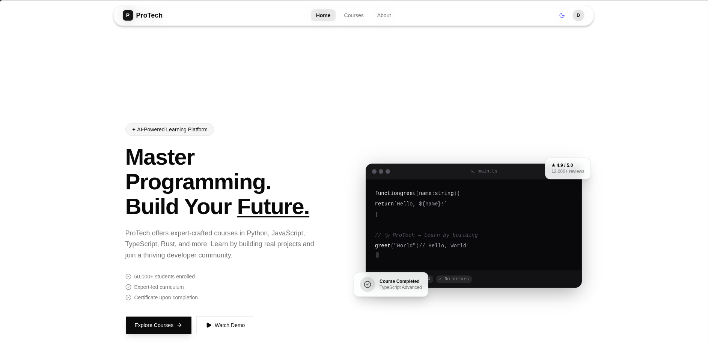
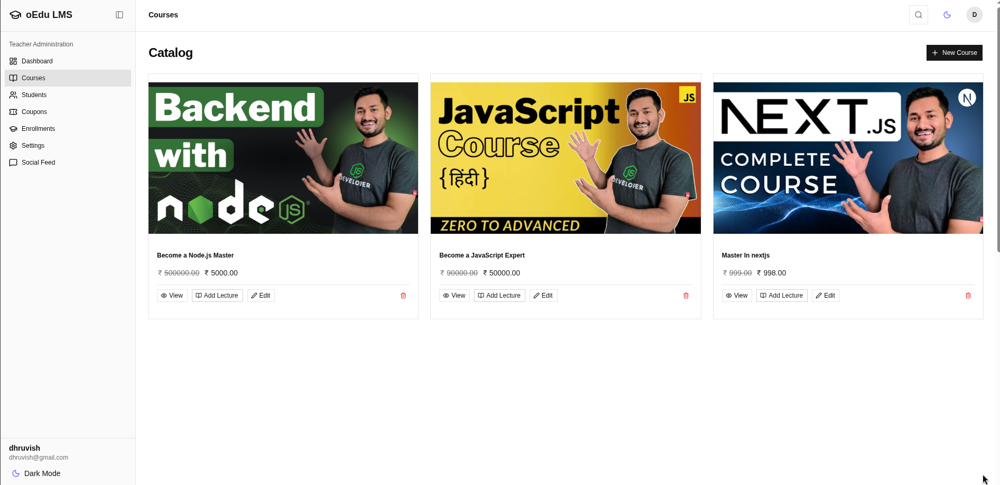
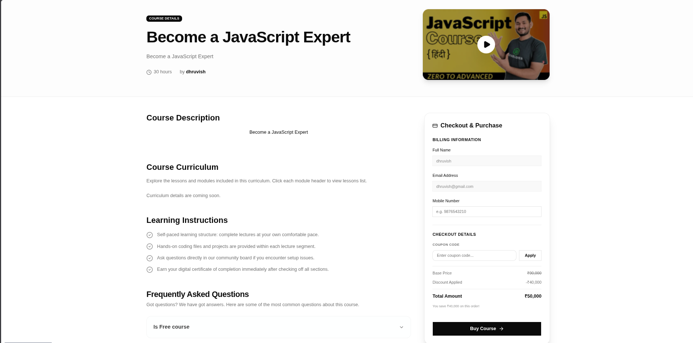

# ProTech LMS (oeduLMS) - Enterprise Learning Management System

🚀 **Live Link**: [https://protech.dhruvish.in](https://protech.dhruvish.in)

Welcome to **ProTech LMS** (oeduLMS), an enterprise-grade, high-performance Learning Management System designed to deliver seamless, engaging, and fast learning experiences.

---

## ℹ️ About the Project

**ProTech LMS** is a modern educational platform that connects students with instructors through interactive curriculum building, video streaming, community boards, and secure course checkouts. The system is designed to solve common challenges in e-learning platforms: high server latencies, expensive video streaming bandwidth bills, and complex course setup flows.

### 🌟 Key Platform Features

- **Premium Interactive Video Playback**: Powered by a custom video player (`@oedulms/dvideo`) that supports adaptive bitrate HLS streaming, keyboard shortcuts, 2x long-press fast-forward, and automatic playback progress resumption.
- **Parallel Transcoding Pipeline**: A fully automated video processing pipeline. When instructors upload videos, they are split and transcoded in parallel into multiple resolutions on on-demand EC2 Spot instances, saving up to 90% in transcoding costs.
- **Secure Payment Integration**: In-app billing using the Razorpay gateway with double-purchase protection, guest checkout registration, and admin refund management.
- **Discussion & Q&A Boards**: Interactive, rich-text lecture Q&A boards (powered by Lexical) and community feeds with comments and likes.
- **Clean, Branded Experience**: A cohesive styling system using Tailwind CSS v4 and MUI's `@base-ui/react` primitives, supporting modern OKLCH color palettes and native dark mode.
- **High-Speed Monorepo Architecture**: Organized as a Turborepo monorepo powered by Bun Workspaces for fast developer builds and efficient cloud deployments.

---





---

## 🗺️ System Architecture

For a comprehensive technical breakdown of the system architecture, including topology diagrams, database designs, authentication mechanisms, serverless video pipelines, payments, and client-side design patterns, please refer to the:

👉 **[Architecture Documentation Portal](./architecture/index.md)**

## 📂 Workspace Folder Architecture

This project is a monorepo structured using Bun Workspaces. It is divided into applications (`apps/`) and shared, type-safe packages (`packages/`).

```
oedulms/
├── apps/                          # Deployable Applications
│   ├── aws-lambda-trigger/        # AWS Lambda handlers for transcoding events
│   ├── ec2-video-worker/          # FFmpeg worker script running on Spot instances
│   ├── server/                    # Hono-based main API server (Cloudflare Worker)
│   └── web/                       # React, Vite, Tailwind CSS v4 Single Page App
├── packages/                      # Internal Shared Packages
│   ├── auth/                      # Session-based auth utilities wrapper (Better Auth)
│   ├── config/                    # Workspace-wide ESLint & TS configurations
│   ├── db/                        # Database schemas, migrations, and Drizzle client
│   ├── dvideo/                    # Premium custom HTML5 & HLS Video Player component
│   ├── infra/                     # AWS CDK infrastructure-as-code deployment stacks
│   ├── ui/                        # Shared Shadcn UI design system components
│   └── validator/                 # Shared Zod schemas for forms and API validation
└── ai-memory/                     # Persistent system design memory for developers
```

### Key Subdirectory Breakdown

#### 🚀 Applications (`apps/`)

- **[apps/web](./apps/web)**: The user-facing application built on React v19, using TanStack Router for route tree definition and TanStack Query for state.
- **[apps/server](./apps/server)**: Edge backend server executing Hono. Handles session authentication routing, checkout endpoints, course catalog updates, Q&A sections, and webhook synchronization.
- **[apps/aws-lambda-trigger](./apps/aws-lambda-trigger)**: Contains lambda functions:
  - `trigger.ts`: Launches Spot nodes and chunks raw videos.
  - `callback.ts`: Integrates chunk statuses, compiles master HLS streams, and reports status changes back to the edge server.
  - `status.ts`: Returns progress metrics.
  - `pipeline-db.ts`: Executes direct SQL transactions on the tracking database.
- **[apps/ec2-video-worker](./apps/ec2-video-worker)**: Long-polling background daemon running inside EC2. Pulls split or encode tasks, executes sub-process FFmpeg instances, and copies final media directly to Cloudflare R2.

#### 📦 Shared Packages (`packages/`)

- **[packages/db](./packages/db)**: Contains the 32 table definitions, foreign key rules, indexes, and compilation tools using Drizzle.
- **[packages/auth](./packages/auth)**: Houses session configurations, OAuth provider setup, rate limit strategies, and transactional mail routing.
- **[packages/dvideo](./packages/dvideo)**: A high-end video player built with glassmorphism styling, keyboard shortcuts, resume playback markers, and automated bandwidth adaptation.
- **[packages/validator](./packages/validator)**: Holds shared Zod validation rules that prevent client-side form bypass and secure database operations.
- **[packages/infra](./packages/infra)**: Contains AWS CDK stacks describing all queues, permissions, API Gateways, and buckets required to operate the media system.

---

## 📈 Next Steps & Reference Guides

For step-by-step developer guidelines on specific layers, refer to the [index.md](./architecture/index.md) inside the `architecture/` directory:

- [System Overview](./architecture/system-overview.md)
- [Database Schema Specs](./architecture/database-design.md)
- [Authentication & Security Policies](./architecture/auth-and-security.md)
- [Video Processing Pipeline Guide](./architecture/video-pipeline.md)
- [Payments & Checkout Flows](./architecture/payments-and-enrollments.md)
- [Frontend State & Design Patterns](./architecture/frontend-patterns.md)
