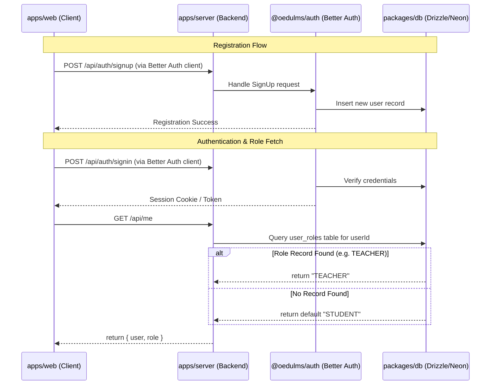

# Authentication & Authorization Architecture

This document describes the authentication flow, role resolution, and validation architecture implemented in the workspace.

## Architecture Diagram

## Shared Validation schemas (`@oedulms/validator`)
The validator package `@oedulms/validator` exports Zod schemas individually.
- Import target: `@oedulms/validator/auth`
- Available schemas:
  - `loginSchema`: validates `email` and `password`.
  - `registerSchema`: validates `name`, `email`, and `password`.
  - `forgotPasswordSchema`: validates `email`.
  - `resetPasswordSchema`: validates `password`.

## Client-Side Authentication Layout & Views
The frontend uses file-based routing via **TanStack Router**:
- **Shared Auth Layout**: [auth.tsx](file:///home/debian/Desktop/coding/lmsoedu/oedulms/apps/web/src/routes/auth.tsx) acts as a layout route wrapping all authentication views.
- **Client Features**: Forms are implemented under `apps/web/src/features/auth/` and use `@tanstack/react-form` along with Zod validation and Shadcn primitives:
  - `login-form.tsx`
  - `register-form.tsx`
  - `forgot-password-form.tsx`
  - `reset-password-form.tsx`

## Role-Based Route Protection
Route protection is enforced inside the route's `beforeLoad` configuration:
- Students route: `/dashboard` (Redirects to `/auth/login` if not authenticated, or to `/admin` if the role is `TEACHER`).
- Teachers route: `/admin` (Redirects to `/auth/login` if not authenticated, or to `/dashboard` if the role is `STUDENT`).
