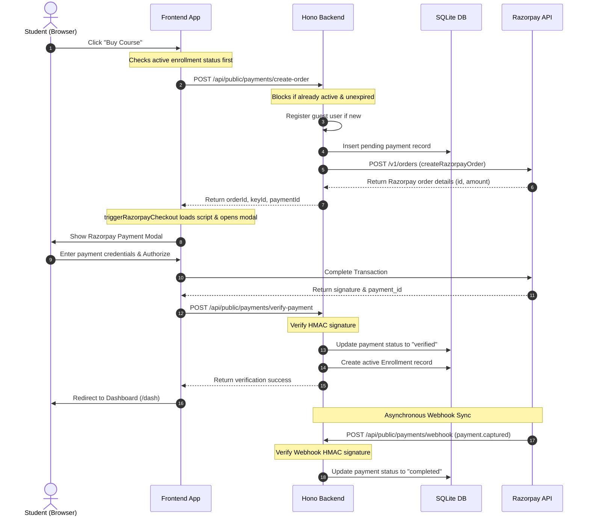

# Razorpay Payment Gateway Integration Flow

This document details the end-to-end implementation of the Razorpay payment gateway integration in the ProTech LMS platform, covering backend order creation, client-side modal rendering, dual-verification statuses (frontend vs. webhooks), and refund operations.

---

## 1. Sequence Diagram



---

## 2. Enrollment Protection Guard

Before allowing checkout, the application checks if the user is already enrolled to prevent double purchases.

### Backend Guard
On `/api/public/payments/create-order`, the server checks:
1. `studentId` (if logged in) or the `studentEmail` (if guest) against the `courseEnrollments` table.
2. If an enrollment exists with status `"active"` and has **not expired**, the API blocks the request with a `400 Bad Request` error.

### Frontend Guard
1. If the student is logged in, the UI calls:
   ```ts
   useCheckEnrollment(courseId, !!auth?.user)
   ```
   which hits the endpoint:
   ```http
   GET /api/dash/enrollments/:courseId/check
   ```
2. If `isEnrolled` returns `true`, the checkout sidebar disables all form fields and replaces the **Buy Course** button with a disabled **Already Purchased** state.
3. While the enrollment check is in progress, the checkout button displays a loading spinner with the label **"Checking status..."**.

---

## 3. Order Creation Workflow

When a user submits the billing form, the order creation endpoint (`POST /api/public/payments/create-order`) executes the following operations:

1. **User Resolution**:
   - If `userId` is passed, the backend skips database queries for performance.
   - If not logged in, the server checks if the email is already registered. If it is, the transaction is linked to the existing user.
   - If the user is entirely new, a new account is registered, and a temporary password is generated and sent via a transactional email using **Resend**.
2. **Pending Payment Insertion**:
   - Inserts a record in the `payments` table with status `"pending"`.
3. **Razorpay Order Creation**:
   - Calls the `createRazorpayOrder` utility, triggering a POST request to `https://api.razorpay.com/v1/orders`.
   - Returns the Razorpay `orderId`, `keyId`, and local `paymentId` to the client.

---

## 4. Frontend Modal Trigger

The frontend uses the utility helper `triggerRazorpayCheckout` defined in `apps/web/src/lib/razorpay.ts`.

- **Script Loading**: Dynamically injects `https://checkout.razorpay.com/v1/checkout.js` into the DOM if not already loaded.
- **Modal Instantiation**: Initializes `window.Razorpay` with prefilled student details (name, email, phone) and the dark theme config (`#09090b`).
- **Dismiss Handling**: Resets the button spinner if the user closes the modal without completing the payment.

---

## 5. Dual Verification Statuses

To ensure payment integrity under various network conditions, the platform implements a dual-verification strategy.

| Status | Verification Method | Finality | Behavior |
| :--- | :--- | :--- | :--- |
| **`verified`** | Frontend API call (`/verify-payment`) | Non-Final | Updated immediately upon signature verification in the browser to redirect the student immediately. |
| **`completed`** | Webhook Notification (`/webhook`) | **Final** | Set asynchronously by the Razorpay webhook listener. A `completed` payment cannot be downgraded to `verified` or `pending`. |

### Order Fulfillment Logic (`fulfillOrder`)
Both verification flows call the central `fulfillOrder` helper, which performs these tasks inside a database transaction:
1. Verifies the status transition: ensures it does not overwrite a `completed` state.
2. Updates the `payments` table with the provider payment ID and verification status.
3. Creates or updates a record in `courseEnrollments` set to `active`.
4. Dispatches the transactional welcome/receipt email to the student.

---

## 6. Admin Refund Operations

Administrators can process partial or full refunds from the admin enrollments portal.

- **Endpoint**: `POST /api/admin/enrollments/:id/refund`
- **Validation**: Enforces that the refund amount does not exceed the total amount paid.
- **Execution**: Calls the `createRazorpayRefund` utility, making an API call to `https://api.razorpay.com/v1/payments/:providerPaymentId/refund`.
- **Database Updates**: Transitions both the payment and the course enrollment records to `"refunded"`.
