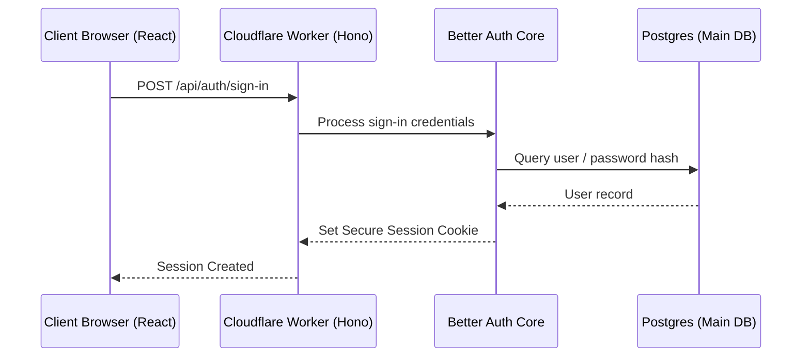

# Authentication, Authorization & Security Policies

Security in ProTech LMS is built on a "defense-in-depth" model. Authentication state, route authorization, CORS origins, and server API access are validated at multiple logical layers.

---

## 🔑 Authentication Mechanism

Authentication is managed via the **Better Auth** framework, which integrates with our shared database schema and custom frontend layouts.



### 1. Session Storage & Cookie Security

Sessions are tracked using cryptographically secure session cookies rather than local storage tokens to protect against cross-site scripting (XSS) extraction. The cookie configurations enforce:

- **`httpOnly`**: Prevents browser scripts from reading the cookie.
- **`secure`**: Ensures the cookie is only transmitted over HTTPS connections.
- **`sameSite: "none"`**: Allows cookies to be sent along with cross-origin requests.

### 2. Rate Limiting

To prevent brute-force attacks and abuse of external email gateways (like Resend), Better Auth enforces rate limit thresholds:

- **General Routes**: Maximum 100 requests per 60 seconds.
- **Email Verification Request (`/send-verification-email`)**: Maximum 3 requests per 60 seconds.
- **Password Recovery Request (`/forget-password`)**: Maximum 3 requests per 60 seconds.

---

## 🛡️ Role-Based Access Control (RBAC)

The application resolves roles (`STUDENT`, `TEACHER`) from the `user_roles` database table. Role protection is enforced on both the client and server.

### 1. Client-Side Guards (TanStack Router)

Routes are protected before they render using TanStack Router's `beforeLoad` option:

- **Student Protected Paths (`/dashboard/**`)**: The router verifies that the user is logged in and does not have the `TEACHER` role. If they are a teacher, they are redirected to `/admin`. Unauthenticated users are redirected to `/auth/login`.
- **Teacher Protected Paths (`/admin/**`)**: The router verifies that the user has the `TEACHER` role. If they are a student, they are redirected to `/dashboard`.

### 2. Server-Side Guards (Hono Middlewares)

API endpoints check the session's role attribute. Unauthorized API requests receive a `403 Forbidden` response instantly.

---

## 🔒 Network & API Security

### 1. CORS Validation

The Hono backend uses CORS middleware to restrict API access:

- Allowed origins are mapped to the environment variable `CORS_ORIGIN`.
- Credentials (cookies) are only sent if the origin matches the allowed configuration.

### 2. Data Validation Boundaries (Zod)

To prevent SQL injection or schema issues, data is validated at both boundaries:

- **Client Boundary**: TanStack Form validates fields in real time using the shared `@oedulms/validator` schemas.
- **Server Boundary**: Hono routes enforce input structures using `@hono/zod-validator` before executing handlers.

```
[User Form] --(Zod Change Validator)--> [API Request] --(Hono zod-validator)--> [Database Write]
```

### 3. Inter-Service Security (Cloudflare to AWS)

The API communication between the Cloudflare Worker server and AWS API Gateway uses:

- **API Keys**: AWS API Gateway routes (`/trigger` and `/status`) require an `x-api-key` header, which is stored as a secret in Cloudflare.
- **Webhook Secrets**: Event payloads sent back from AWS Lambda to Hono `/api/public/video/pipeline-callback` require custom HTTP signature validations to verify authenticity.
- **Least-Privilege AWS IAM**: EC2 worker instances are restricted to specific staging S3 bucket accesses and SQS queues using custom IAM Instance Profiles.
