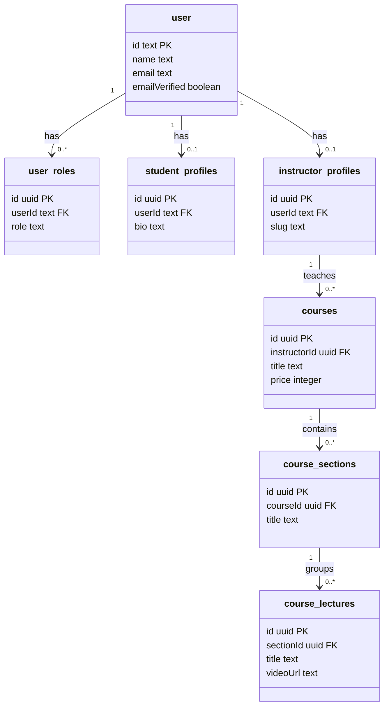

# Database Design & Schema Specifications

ProTech LMS is backed by **Neon Serverless PostgreSQL** and mapped using **Drizzle ORM**. To maintain reliability during high-frequency write operations, the system employs a dual-database design.

---

## 🗄️ Database Choice & Driver

1.  **Neon Serverless PostgreSQL**: Allows scalable connections, instantaneous serverless response times, and database branching.
2.  **Neon HTTP Driver**: Connection pools can be exhausted quickly by serverless functions (like Cloudflare Workers). To prevent this, the backend accesses Postgres over HTTP using the `@neondatabase/serverless` HTTP connection driver, which avoids the overhead of persistent TCP handshakes.
3.  **Drizzle ORM**: Used to provide full type-safety for queries, schema changes, and migration history (located under `packages/db`).

---

## 🧩 Schema Modules

The primary database contains 32 tables grouped into logical modules:



### 1. User Profiles & Authentication (`auth.ts`, `profiles.ts`)

- **`user`**: User accounts (name, email, email status, ban status, timestamps).
- **`session`**: Tracks active web sessions, tokens, IP address, and user agents.
- **`account`**: Connects third-party identity providers (OAuth).
- **`verification`**: Holds challenges for signup and password reset.
- **`user_roles`**: Maps user IDs to roles (e.g. `STUDENT`, `TEACHER`). Includes a unique constraint on `(user_id, role)`.
- **`student_profiles`**: Holds bio details, social links, country, and phone numbers.
- **`instructor_profiles`**: Houses custom bio, verify status, slugs, cover images, and ratings.

### 2. Courses, Lectures & Resources (`courses.ts`)

- **`courses`**: Main catalog entries (instructor ID, title, pricing in cents, status like DRAFT/PUBLISHED, duration, cert enabled).
- **`course_sections`**: Intermediate module headers that group lectures.
- **`course_lectures`**: Lectures details, references to video streaming URLs, thumbnails, and preview access.
- **`lecture_resources`**: Downloadable handouts, PDFs, and assets linked to specific lectures.
- **`course_faqs`**: Frequently asked questions.
- **`course_tags` & `course_tag_relations`**: Metadata tags and junction table linking tags to courses.

### 3. Enrollments, Progress & Reviews (`enrollments.ts`)

- **`course_enrollments`**: Connects student accounts to course access states (active, expired, refunded), progress completion ratios, and payments.
- **`lecture_progress`**: Tracks progress per lecture (in seconds watched) to enable resume playback functionality.
- **`course_reviews`**: Course ratings (1-5) and text feedback.

### 4. Interactions & Discussion Board (`discussions.ts`, `posts.ts`)

- **`lecture_comments` & `lecture_comment_reactions`**: Handles threaded discussions on lectures.
- **`lecture_questions` & `lecture_question_answers`**: Structured Q&A board where students post questions and instructors/peers post answers.
- **`posts` & `post_comments` & `post_likes`**: Core tables backing the social student/teacher discussion board.

### 5. Financials (`payments.ts`, `coupons.ts`)

- **`payments`**: Records of Razorpay transactions (payment ID, order ID, amounts, statuses like pending/verified/completed).
- **`coupons` & `coupon_courses` & `coupon_redemptions`**: Configures coupons, applies usage limits, and tracks redemptions.

---

## ⚡ Performance Isolation: The Pipeline Database

When videos are transcoded, workers upload chunks and ping the API continuously with progress updates. To protect the main system database from being overwhelmed, a **dedicated Pipeline Database** is provisioned.

### The Pipeline State Schema (`video_pipeline_state`)

Progress is stored in a separate database instance containing a single high-performance table:

```sql
CREATE TABLE video_pipeline_state (
  video_id          TEXT        PRIMARY KEY,
  status            TEXT        NOT NULL DEFAULT 'SPLITTING', -- SPLITTING, ENCODING, READY, ERROR
  duration_seconds  INTEGER,
  total_chunks      INTEGER,
  completed_chunks  INTEGER     NOT NULL DEFAULT 0,
  qualities         TEXT,       -- JSON array string (e.g. '[360, 720, 1080]')
  master_url        TEXT,       -- HLS master playlist URL on Cloudflare R2
  error_message     TEXT,       -- Stores errors if status = 'ERROR'
  created_at        TIMESTAMPTZ NOT NULL DEFAULT NOW(),
  updated_at        TIMESTAMPTZ NOT NULL DEFAULT NOW()
);
```

> [!NOTE]
> Separating database connection pools ensures that even if hundreds of transcoding tasks are writing progress logs simultaneously, student transactions and login flows remain fast and unaffected.
