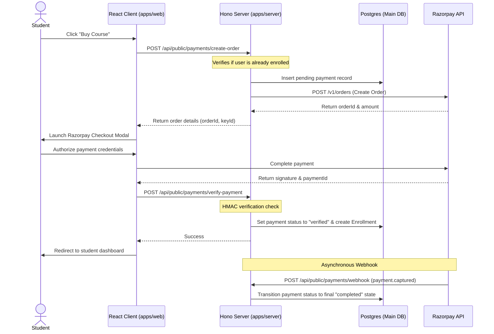

# Payments, Checkout & Enrollments

ProTech LMS integrates the **Razorpay** payment gateway to process student course purchases. The platform uses a double-purchase protection guard and a dual-verification sync model to keep user enrollment records accurate.

---

## 💳 Checkout & Enrollment Sequence

---

## 🛡️ Double-Purchase Protection Guard

To prevent students from buying the same course twice, we implement guards on both the frontend and backend:

### 1. Backend Guard

- **Location**: `POST /api/public/payments/create-order`
- **Action**: The server queries the `courseEnrollments` table using the student's ID (if authenticated) or email (if checking out as a guest).
- **Result**: If an active, unexpired enrollment is found, the server rejects the request with a `400 Bad Request` error.

### 2. Frontend Guard

- **Action**: The checkout screen calls the `GET /api/dash/enrollments/:courseId/check` endpoint.
- **Result**: While this check is running, a loading spinner is displayed. If the student is already enrolled, the checkout form fields are disabled and the checkout button is replaced with a disabled **"Already Purchased"** button.

---

## 🔑 Guest Checkout & User Provisioning

When a guest user purchases a course:

1.  **Account Lookup**: The server checks if the billing email is already registered. If it is, the transaction is linked to that account.
2.  **Auto-Provisioning**: If the email is new, the server automatically creates a user record and generates a temporary password.
3.  **Notifications**: The system sends a welcome email containing the temporary credentials using **Resend**, allowing the guest student to log in immediately after checkout.

---

## 🔄 Dual Verification Flow

To prevent database inconsistencies caused by network dropouts or user actions (like closing the tab before verification finishes), payments use a dual-status verification model:

| Status          | Trigger Source     | Finality  | Behavior                                                                                                             |
| :-------------- | :----------------- | :-------- | :------------------------------------------------------------------------------------------------------------------- |
| **`verified`**  | Client API request | Non-Final | Updated immediately after the client passes HMAC verification, allowing the user to access the course without delay. |
| **`completed`** | Webhook callback   | **Final** | Written asynchronously by Razorpay's webhook listener (`payment.captured`). It cannot be rolled back or downgraded.  |

Both verification paths call the shared `fulfillOrder` utility inside a database transaction. This utility:

1.  Checks and transitions the payment record status.
2.  Creates or updates the `courseEnrollments` record to `active`.
3.  Sends a payment receipt email to the student.

---

## 💸 Refund Workflows

Administrators can issue full or partial refunds directly from the admin panel:

- **Endpoint**: `POST /api/admin/enrollments/:id/refund`
- **Validation**: The system verifies that the refund amount does not exceed the original payment amount.
- **API Action**: Calls Razorpay's refund endpoint (`POST /v1/payments/:id/refund`).
- **DB Action**: Transitions both the payment and the course enrollment records to `"refunded"`.
