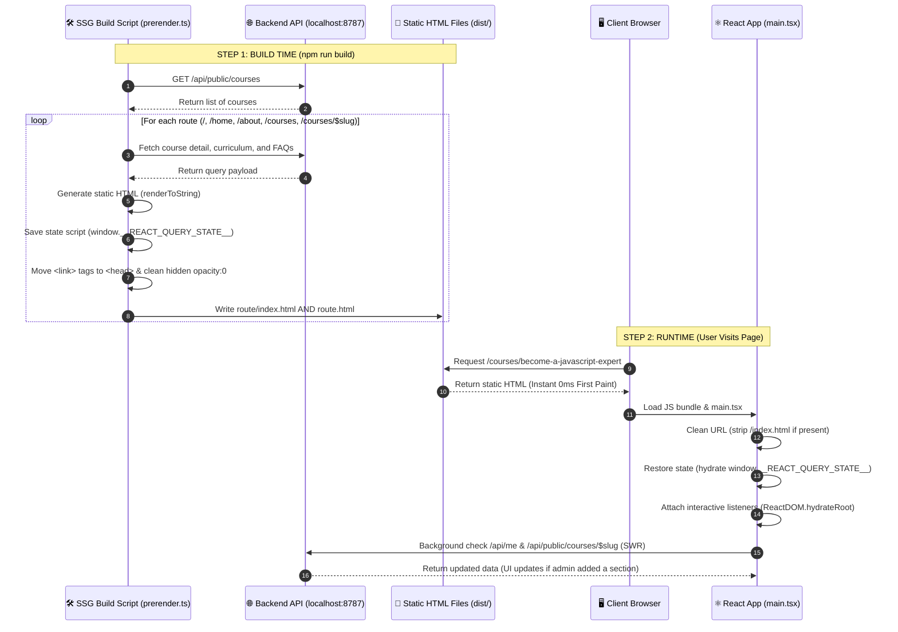

# 🚀 SSG & Pre-rendering Architecture (Easy-to-Understand Guide)

This document explains **how Static Site Generation (SSG), pre-rendering, state hydration, and live dynamic updates work** in `apps/web`.

---

## ⚡ 1. The 3-Minute Plain English Summary

When a user visits your website (for example, `/courses/become-a-javascript-expert`), they want **instant page loads** and **working interactive buttons** (like video preview modals or collapsible accordion sections).

### 🛠️ How It Works in 3 Simple Steps:

1. **At Build Time (`npm run build`)**:
   - Bun runs `scripts/prerender.ts`.
   - It fetches real course data from the live API (`http://localhost:8787/api/public/courses`).
   - It pre-renders full HTML pages (with text, curriculum, FAQs, titles, and dark mode colors) and saves them into the `dist/` folder.
   - It embeds the fetched API data into `<head>` inside `<script>window.__REACT_QUERY_STATE__ = ...</script>`.

2. **When the User Opens the Page (First 0ms Paint)**:
   - The browser loads the static HTML file immediately.
   - **Zero waiting, zero blank screen, zero loading spinner.** The text, images, and dark mode styles are visible instantly on line 1.

3. **When JavaScript Hydrates (Client-Side Interactivity & SWR)**:
   - React loads `main.tsx` and reads `window.__REACT_QUERY_STATE__` to restore the API data into memory.
   - React connects event listeners (`ReactDOM.hydrateRoot`) so buttons, dropdowns, and accordion collapses work smoothly.
   - **Stale-While-Revalidate (SWR)**: React Query checks the backend in the background. If an admin added a new section to the curriculum, the page **automatically updates on screen** without requiring a page reload!

---

## 📊 2. System Architecture & Flow Diagram



---

## 📂 3. Where is the Code Located? (File Cheatsheet)

| Feature / Task                 | File Path                                                     | Line / Component       | What it Does                                                                                                       |
| ------------------------------ | ------------------------------------------------------------- | ---------------------- | ------------------------------------------------------------------------------------------------------------------ |
| **SSG Build Engine**           | `apps/web/scripts/prerender.ts`                               | Entire File            | Pre-renders static HTML files and injects dehydrated React Query state into `<head>`.                              |
| **Isolated Route Tree**        | `apps/web/src/publicRouteTree.ts`                             | `getPublicRouteTree()` | Creates a lightweight public route tree that avoids heavy modules (like Lexical editor) during SSG.                |
| **React Hydration & Mounting** | `apps/web/src/main.tsx`                                       | Line 11-70             | Restores `window.__REACT_QUERY_STATE__`, cleans trailing `/index.html` from URL, and calls `ReactDOM.hydrateRoot`. |
| **SWR & Query Options**        | `apps/web/src/api/courses.ts`                                 | Line 140-195           | Sets `staleTime: 0` so static HTML displays instantly while background SWR checks for new sections.                |
| **Course Details Page**        | `apps/web/src/features/public/courses/course-detail-page.tsx` | Line 106 & 135         | Passes `slug` to `<CourseCurriculum>` and `<CourseFaqs>` to ensure 100% cache hits during hydration.               |
| **Base Index HTML**            | `apps/web/index.html`                                         | Line 1-21              | Sets dark theme class on `<html>` and default background/text colors on `<body>`.                                  |

---

## 🛠️ 4. Problems We Fixed & How

### ❌ Problem 1: Page below navbar was completely black / invisible

- **Cause**: Framer Motion (`motion.div`) renders `initial={{ opacity: 0 }}` as inline `style="opacity: 0"` into static HTML during server-side rendering.
- **Fix**: Updated `scripts/prerender.ts` to automatically strip `style="opacity: 0..."` from pre-rendered HTML before saving static files to `dist/`. Now static HTML is 100% visible on first paint.

### ❌ Problem 2: Buttons (Preview modal, Accordions) didn't work on static pages

- **Cause**: `main.tsx` contained an `if (!rootElement.innerHTML)` check. Because pre-rendered SSG pages already had HTML inside `<div id="app">`, React client hydration was completely skipped!
- **Fix**: Removed `if (!rootElement.innerHTML)` and added `ReactDOM.hydrateRoot(rootElement, appContent)` whenever pre-rendered HTML content exists.

### ❌ Problem 3: `/courses` without trailing slash loaded the homepage

- **Cause**: `vite preview` looks for `dist/courses.html` when accessing `http://localhost:4173/courses`. When `courses.html` was missing, Vite defaulted to SPA fallback (`dist/index.html` - the homepage).
- **Fix**: Updated `scripts/prerender.ts` to generate **both** `dist/<route>/index.html` AND `dist/<route>.html`.

### ❌ Problem 4: Adding a new section in admin panel didn't update on the public page

- **Cause**: Fixed cache or long `staleTime` prevented public pages from checking for fresh data.
- **Fix**: Configured `staleTime: 0` on public course query options (**Stale-While-Revalidate**). The page renders static HTML instantly (0ms), then checks the backend in the background and seamlessly updates the UI if new sections exist.

---

## ❓ 5. Frequently Asked Questions (FAQ)

#### Q1: What happens if an admin adds a new section to the course curriculum?

> **Answer**: Because of the Stale-While-Revalidate (SWR) pattern, the public course page loads instantly from the pre-rendered cache, then silently checks the backend in the background. As soon as the background API call returns, the new section automatically appears on the user's screen.

#### Q2: Why do we generate both `dist/courses/index.html` and `dist/courses.html`?

> **Answer**: Different web servers handle URLs differently. Servicing `/courses/` looks for `index.html` inside a folder, while servicing `/courses` without a trailing slash looks for `courses.html`. Generating both guarantees 100% compatibility with Vite Preview, Nginx, Apache, Netlify, and Cloudflare Pages.

#### Q3: How do I rebuild the pre-rendered static files?

> **Answer**: Simply run:
>
> ```bash
> npm run build
> ```
>
> This compiles Vite assets and executes `bun scripts/prerender.ts` to fetch live course data and re-generate all static HTML files in `dist/`.

#### Q4: How do I test the pre-rendered static site locally?

> **Answer**: Run:
>
> ```bash
> bun run serve
> ```
>
> Then open `http://localhost:4173/courses/become-a-javascript-expert` in your browser.
