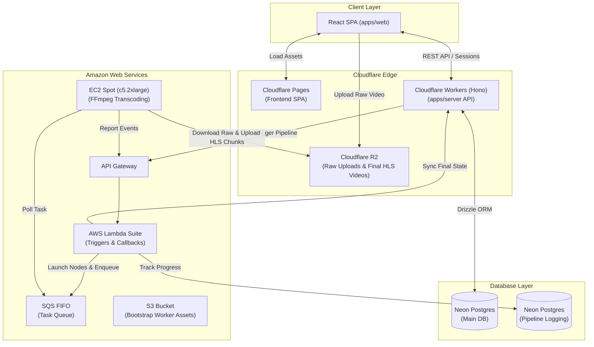

# System Architecture & Monorepo Overview

ProTech LMS is designed as a high-performance, modular monorepo that divides workloads between edge computing and on-demand cloud computing. This document breaks down the components of the codebase and details how they interact.

---

## 🏗️ Architectural Topology

The system splits runtime execution into two core clouds to maximize speed and minimize compute costs:

1.  **Cloudflare Edge**: Run the frontend application (Pages) and the API server (Workers). By running authentication and database query handlers close to users, the application achieves extremely low page-load latencies.
2.  **Amazon Web Services (AWS)**: Orchestrates heavy, long-running compute workloads (specifically video splitting, processing, and transcoding) on demand.

---

## 🛠️ Technology Stack

ProTech LMS is built on a modern, high-performance tech stack optimized for serverless execution and rapid local builds:

- **Monorepo Tools**: [Turborepo](https://turbo.build/) (incremental builds and execution pipelines), [Bun](https://bun.sh/) (runtime engine, workspace manager, and package manager).
- **Web Frontend**: React 19, [Vite](https://vite.dev/) (asset compiler), [Tailwind CSS v4](https://tailwindcss.com/) (modern utility styling), [TanStack Router](https://tanstack.com/router) (type-safe routing), [TanStack Query](https://tanstack.com/query) (server state caching), [TanStack Form](https://tanstack.com/form) (headless input management), [Base UI primitives](https://base-ui.com/) (unstyled accessibility primitives), [Motion](https://motion.dev/) (micro-animations), [Lexical](https://lexical.dev/) (rich text), and [Dnd Kit](https://dndkit.com/) (curriculum drag-and-drop).
- **Edge API Server**: [Hono](https://hono.dev/) (ultrafast server framework), [Better Auth](https://www.better-auth.com/) (session-based client auth), and [Evlog](https://github.com/) (JSON telemetry logging).
- **Media Pipeline**: Node.js, [FFmpeg](https://ffmpeg.org/) (video transcoding), AWS Lambda (serverless triggers), AWS API Gateway, AWS SQS FIFO (message queue), and EC2 Spot instances (c5.2xlarge instances).
- **Infrastructure**: [AWS CDK](https://aws.amazon.com/cdk/) (TypeScript Infrastructure-as-Code definitions).

---

## 📂 Workspace Folder Directory

The monorepo contains deployable projects under `apps/` and shareable dependencies under `packages/`:

### 🚀 Applications (`apps/`)

- **[apps/web](../apps/web)**:
  React 19 single-page client built with Vite, styled with Tailwind CSS v4, and utilizing TanStack Router for route protection and client state.
- **[apps/server](../apps/server)**:
  Hono API server deployed as a Cloudflare Worker. Hosts public, dashboard, student, and admin APIs. Handles database connections, Razorpay verify actions, and webhooks.
- **[apps/aws-lambda-trigger](../apps/aws-lambda-trigger)**:
  Contains Lambda handlers for the video pipeline:
  - `trigger.ts`: Splits raw videos and starts EC2 nodes.
  - `callback.ts`: Records completed chunks and builds the `master.m3u8` play index.
  - `status.ts`: Reports progress metrics to the admin dashboard.
- **[apps/ec2-video-worker](../apps/ec2-video-worker)**:
  The background transcoding daemon running on AWS EC2. Polls SQS FIFO for encoding tasks and runs FFmpeg subprocesses to export segmented HLS playlists directly to Cloudflare R2.

### 📦 Shareable Packages (`packages/`)

- **[packages/db](../packages/db)**:
  Database schema mapping, connection initialization using Neon's HTTP serverless driver, and SQL migrations using Drizzle ORM.
- **[packages/auth](../packages/auth)**:
  Better Auth configuration, hooks, session rules, rate-limiting guidelines, and Resend client for password recovery.
- **[packages/dvideo](../packages/dvideo)**:
  A premium HLS video player package containing canvas-based custom overlays, keyboard bindings, 2x click-and-hold accelerators, and playback resume states.
- **[packages/ui](../packages/ui)**:
  The shared design system. Contains component primitives (buttons, inputs, cards, fields) shared by all frontend interfaces.
- **[packages/validator](../packages/validator)**:
  Zod schemas shared between frontend inputs (TanStack Form) and backend validations (Hono `zValidator`).
- **[packages/infra](../packages/infra)**:
  AWS CDK codebase detailing SQS queues, staging buckets, API Gateways, and IAM roles for infrastructure as code.
- **[packages/config](../packages/config)**:
  Central configurations (TSConfig, ESLint) maintaining strict code style rules.
